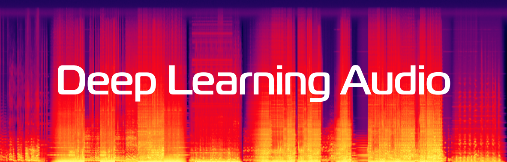

# Deep Learning Audio Course, 2022

## Description
Topics discussed in course:
- Digital Signal Processing
- Automatic Speech Recognition (ASR)
- Text-to-Speech (TTS)
- Key-word spotting (KWS)
- Voice Conversion

## Course materials

| Lecture | Date | Description | Slides | Video |
|---------|------|-------------|--------|-------|
| 1 | September, 15 | Introduction | [slides](lectures/lecture01/Severilov2022DLAudio1.pdf) | [video](https://www.youtube.com/watch?v=33vG2wfMIxs) |
| 2 | September, 23 | Digital Signal Processing | [slides](lectures/lecture02/Severilov2022DLAudio2.pdf) | [video](https://www.youtube.com/watch?v=EW_EojFHUhk) |
| 3 [seminar] | September, 29 | Spectrograms and the Griffin-Lim Algorithm | [notebook](https://github.com/severilov/2022-DL-Audio-Course/blob/main/seminars/seminar1.ipynb) | [video](https://www.youtube.com/watch?v=7m3sk_P-y-4&list=PLk4h7dmY2eYHfxOR8PO_v6nu5crh6tMG-&index=3) |
| 4 | October, 21 | Automatic Speech Recognition 1 (ASR-1) | [slides](lectures/lecture03/Severilov2022DLAudio3.pdf) | [video](https://www.youtube.com/watch?v=kn0kyoo2fAk) |
| 5 | October, 28 | Automatic Speech Recognition 2 (ASR-2) | [slides](lectures/lecture04/Severilov2022DLAudio4.pdf) | [video](https://www.youtube.com/watch?v=dQw4w9WgXcQ&ab_channel=RickAstley) |
| 7 [seminar] | November, 3 | [notebook](https://github.com/severilov/2022-DL-Audio-Course/blob/main/seminars/seminar2.ipynb) | [video](https://www.youtube.com/watch?v=dQw4w9WgXcQ&ab_channel=RickAstley) |
| 8 | November, 10 | Key-word spotting (KWS) | [slides](lectures/lecture05/Severilov2022DLAudio5.pdf) | [video](https://www.youtube.com/watch?v=dQw4w9WgXcQ&ab_channel=RickAstley) |
| 9 | November, 17 | Text to Speech (TTS) | [slides](lectures/lecture06/Severilov2022DLAudio6.pdf) | [video](https://www.youtube.com/watch?v=dQw4w9WgXcQ&ab_channel=RickAstley) |
| 10 [seminar] | November, 24 | [notebook](https://github.com/severilov/2022-DL-Audio-Course/blob/main/seminars/seminar3.ipynb) | [video](https://www.youtube.com/watch?v=dQw4w9WgXcQ&ab_channel=RickAstley) |
| 11 | December, 1 | Voice Conversion | [slides](lectures/lecture07/Severilov2022DLAudio7.pdf) | [video](https://www.youtube.com/watch?v=dQw4w9WgXcQ&ab_channel=RickAstley) |

## Homeworks

| Homework | Date | Deadline | Description | Link |
|---------|------|-------------|--------|-------|
| 1 | TBA | Nov, 3 | Nov, 17 | [notebook](homeworks/homework1/hw1.ipynb) |
| 2 | TBA | ~Nov, 17 | Dec, 1 | [notebook](homeworks/homework2/hw2.ipynb) |

